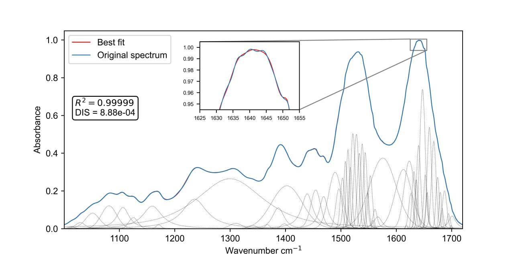

# Machine Learning Methods for HbA1c Prediction

This repository contains code accompanying the preprint *Complementary machine learning approaches for HbA1c prediction from FTIR blood spectra"*.

<p align="center">
  
</p>

## Installation
```bash
git clone https://github.com/yourusername/ftir-hba1c-prediction.git
cd ftir-hba1c-prediction

poetry install

pip install -e .
```

**Note**: This installation includes CPU-only versions of PyTorch and JAX. For GPU support, you'll need to install the appropriate CUDA-enabled versions separately.

**JAXFit**: This repository uses a personal fork of JAXFit with fixes for compatibility with newer JAX versions.

## Quick Start

### Loading Data

```python
from spectral_core import SpectralDataset

dataset = SpectralDataset.from_csv(
    file_path='data/dataset_681.csv',
    wavenumbers_path='data/wavenumbers.csv'
)

dataset.summary()

dataset.plot_spectra(feature='HbA1c')
```

### Preprocessing

```python
from spectral_core import (
    PreprocessingPipeline, 
    SavitzkyGolayFilter, 
    Normalization, 
    RegionSelector,
    SampleFilter
)

pipeline = PreprocessingPipeline([
    SampleFilter(feature_max={"HbA1c": 14.0}, exclude_indices=[287, 636]),
    SavitzkyGolayFilter(window_length=32, polyorder=2, deriv=1),
    Normalization(method='vector'),
    RegionSelector(regions=[(800, 1800), (2800, 3400)])
])

preprocessed_data: SpectralData = pipeline.apply(dataset)
```

### Data Splitting

```python
from spectral_core import DataSplitter

splitter = DataSplitter(
    test_size=0.2,
    val_size=0.2,
    random_state=34
)

split = splitter.train_val_test_split(preprocessed_data)
splitter.save_split(split, output_dir='data/cnn/')
```

## Models

### PLSR


```python
from spectral_core import PLSRComponents

plsr = PLSRComponents(target_name='HbA1c', scale=False)
n_components = plsr.fit(
    split.train.spectra, 
    split.train.get_feature('HbA1c'),
    ncomp=20,
    cv=5,
    threshold=0.05
)

fig, ax = plsr.evaluate(
    split.test.spectra,
    split.test.get_feature('HbA1c'),
    text_pos=(5.0, 12.0)
)
```

### 1D-CNN

For detailed CNN training workflow, see `notebooks/cnn_model.ipynb`.

#### Training

The CNN implementation uses PyTorch Lightning with a flexible CLI-based training system.

```bash
# Train with config file
python -m spectral_core.cnn1d.main fit --config src/spectral_core/cnn1d/config/train_config.yaml

# Or customize training parameters
python -m spectral_core.cnn1d.main fit \
    --model.input_size 1956 \
    --model.learning_rate 0.001 \
    --data.data_dir data/cnn/ \
    --trainer.max_epochs 100
```

### Curve Fitting with SpectraFit

For spectral curve fitting and peak analysis, see `notebooks/curvefit.ipynb`

The `SpectraFit` class uses JAXFit library for modeling spectral data. Peak positions should be identified beforehand.

```python
from spectral_core.curvefit.curvefit import SpectraFit

params = {
    "center": {"min": 3, "max": 3},
    "fwhm": {"value": 3},
    "eta": {"value": 0.5}
}

model = SpectraFit()
model.fit(x_values, y_values, peaks, param_dict=params, ftol=1e-12)

fig = model.plot_fit_plotly()
fig.show()
print(f"R²: {model.r2:.5f}, Discrepancy: {model.discrepancy:.3e}")
```
